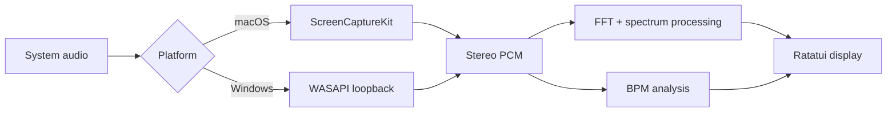

<h1 align="center">terb</h1>

<p align="center">
  <a href="README.zh-CN.md">简体中文</a> · <strong>English</strong>
</p>

<p align="center">
  <strong>System audio, in your terminal.</strong><br>
  Live spectrum, waveform, and beat tracking for macOS and Windows.
</p>

<p align="center">
  
  
  
  
  
</p>

<p align="center">
  <a href="#quick-start"><strong>Get started</strong></a> ·
  <a href="#what-it-shows">Features</a> ·
  <a href="#controls">Controls</a> ·
  <a href="#configuration">Config</a> ·
  <a href="#how-it-works">How it works</a> ·
  <a href="#documentation">Docs</a>
</p>

<p align="center">
  
</p>

`terb` turns the audio already playing on your computer into a spectrum you can shape. A transparent terminal canvas, three restrained palettes, and a single-row toolbar keep the music in view. Audio is analyzed locally without saving a recording.

## Quick Start

Prebuilt binaries are available on the [Releases page](https://github.com/pentaoa/terb/releases). Keep `terb` and `terb-audio-helper` in the same directory when installing a macOS download. The Windows package is a single `terb.exe`; place it on your PATH. Run `terb --version` to check the installed version.

**Requires:** Rust stable, plus:

- **macOS 14+** with the Swift compiler from Xcode or Xcode Command Line Tools
- **Windows 10+** with [Windows Terminal](https://aka.ms/terminal) or another Unicode-capable terminal

```bash
git clone https://github.com/pentaoa/terb.git
cd terb
cargo run --release --locked
```

Play some audio, then press **Space** to start. Use the release build for normal listening. On macOS, the Swift capture helper is compiled automatically during the build.

> [!NOTE]
> On first capture, macOS may request **Screen & System Audio Recording** permission. If capture is denied, allow your terminal or the Terb helper in System Settings, then press Space to try again.
>
> Windows captures the default playback device through WASAPI loopback. No extra permission prompt is shown. Exclusive-mode or protected audio may be missing from the mix.

Transparency follows your terminal profile. Terb leaves the background at its terminal default; set opacity in your terminal app.

## What It Shows

| View | What you get |
| --- | --- |
| **Spectrum** | Blocks, Braille, or CAVA-style stepped bars that expand with the terminal |
| **Waveform** | A signed waveform rendered with Braille subpixels |
| **Stereo meter** | Separate left/right levels beside the spectrum |
| **Beat tracking** | BPM and a beat pulse, with ONNX, Traditional, and Off modes |
| **Trails & accents** | Fading peaks, rising accent contours, or note-name bursts |
| **Themes** | Spring, Vintage, and Mono; all preserve the terminal background |

The toolbar holds **start/pause · settings · help**, with BPM at the right when enabled. Hide it to give the row back to the spectrum. Smaller windows shorten the labels and hide meters as needed. Permission and capture errors remain visible when the toolbar is hidden.

## Controls

| Where | Key | Action |
| --- | --- | --- |
| Menu / Spectrum / Settings | <kbd>Space</kbd> | Start or pause capture; stays in Settings when used there |
| Menu / Settings | <kbd>↑</kbd> <kbd>↓</kbd> or <kbd>j</kbd> <kbd>k</kbd> | Move the selection |
| Menu | <kbd>Enter</kbd> | Open the selected item |
| Menu / Spectrum | <kbd>s</kbd> | Open Settings |
| Spectrum | <kbd>t</kbd> / <kbd>m</kbd> / <kbd>w</kbd> | Toggle toolbar / stereo meter / waveform |
| Settings | <kbd>←</kbd> <kbd>→</kbd> or <kbd>h</kbd> <kbd>l</kbd> | Adjust and save the selected setting |
| Settings | <kbd>Tab</kbd> / <kbd>Shift</kbd> + <kbd>Tab</kbd> | Next / previous category |
| Settings | <kbd>s</kbd>, <kbd>q</kbd>, or <kbd>Esc</kbd> | Return to the page that opened Settings |
| Any view | <kbd>?</kbd> | Open help; press again to return |
| Help | <kbd>Enter</kbd>, <kbd>q</kbd>, or <kbd>Esc</kbd> | Return to the page that opened help |
| Spectrum | <kbd>q</kbd> or <kbd>Esc</kbd> | Return to the main menu |
| Menu | <kbd>q</kbd> or <kbd>Esc</kbd> | Quit |

Audio analysis continues while Settings or help is open. Pausing capture holds the last visual frame.

## Configuration

Open **Settings** with <kbd>s</kbd>. Changes save immediately to `~/.config/terb/config.json` (or `%USERPROFILE%\.config\terb\config.json` on Windows). The interface supports **中文 · English · 日本語**.

### Analysis presets

| Preset | FFT size | Analysis hop | Refresh rate |
| --- | ---: | ---: | ---: |
| **Low Latency** — default | 1,024 | 256 | 90 Hz |
| Balanced | 2,048 | 512 | 60 Hz |
| Precision | 8,192 | 2,048 | 45 Hz |

Low Latency favors response; larger FFT windows give finer frequency resolution. Each preset also sets attack and release. Individual adjustments allow a custom setup.

### Display & processing

| Group | Settings |
| --- | --- |
| Appearance | Theme, renderer, frequency bands, toolbar, stereo meter, waveform |
| Motion | Attack/release, spectrum trail and decay, accent mode and threshold |
| Spectrum | FFT size, analysis hop, refresh rate, adaptive sensitivity, noise reduction |
| Tone & height | High-shelf compensation and gain, height curve and power, limiter ceiling |
| Tempo | ONNX model, traditional spectral-flux analysis, or Off |

The default view uses **Spring**, **Blocks**, and **72 base frequency bands**, with the toolbar and stereo meter visible. The waveform starts hidden. Display resolution adapts to terminal width; the settings panel shows configured and effective values where they differ.

<details>
<summary>Adjustable ranges</summary>

| Setting | Range |
| --- | --- |
| Base frequency bands | 8–256 |
| FFT size / analysis hop | 512–16,384 / 64–4,096 samples |
| Refresh rate | 12, 24, 30, 45, 60, 90, 120, 144, 165, 240 Hz |
| Attack / release | 2–100% / 0–99.5% |
| High-shelf gain | 0–36 dB |
| Noise reduction | 0–95% |
| Height curve power | 0.25–2.50 |
| Trail decay | 20–99.5% |
| Accent threshold | 2–98% |
| Limiter ceiling | 35–100% |

</details>

## How It Works

On macOS, a small Swift helper captures system audio through **ScreenCaptureKit**. On Windows, WASAPI loopback records the default playback mix. Both stream stereo PCM into Rust; spectrum analysis processes every complete FFT window at the selected hop, and the terminal draws the latest result at its own refresh rate.



The default BPM mode runs an embedded ONNX model on a bounded CPU worker using **RTen**. Inference stays off the audio/UI thread. Traditional mode uses spectral flux and rolling autocorrelation; Off skips tempo analysis. A new capture resets analysis history, and dropped BPM blocks invalidate stale history.

Adaptive sensitivity lifts quiet input gradually and reduces gain when peaks approach the ceiling. Accent contours fade upward after an energy rise; note-name mode places fading labels in empty spectrum cells. Themes change foreground colors without filling the background.

<details>
<summary>Project layout</summary>

```text
assets/beat_tracker.onnx        Embedded beat model
macos/SystemAudioHelper.swift  ScreenCaptureKit capture helper
src/capture.rs                 macOS helper and Windows WASAPI capture
src/main.rs                    Terminal views, controls, spectrum processing
src/analysis.rs                Spectrum sampling utilities
src/beat.rs                    ONNX worker and beat decoder
src/bpm.rs                     Traditional tempo analysis
src/features.rs                Streaming Mel features
src/bin/                       Offline BPM and benchmark tools
docs/                          Model notes, data provenance, experiments
```

</details>

## Development

```bash
cargo test --all-targets --locked
cargo build --release --locked --bins
```

Development builds optimize the inference and FFT dependencies while retaining debug information. Offline tests cover signal processing, rendering, and navigation; live capture is a separate manual check.

## Documentation

| Document | Contents |
| --- | --- |
| [Current beat model](docs/current-beat-model.zh-CN.md) | Model, streaming features, scheduling, and latency — 中文 |
| [Dataset provenance](docs/beat-data.zh-CN.md) | Training/evaluation data sources and attribution — 中文 |
| [Sealed benchmark report](docs/benchmarks/giantsteps-sealed-report.md) | Recorded GiantSteps evaluation results |
