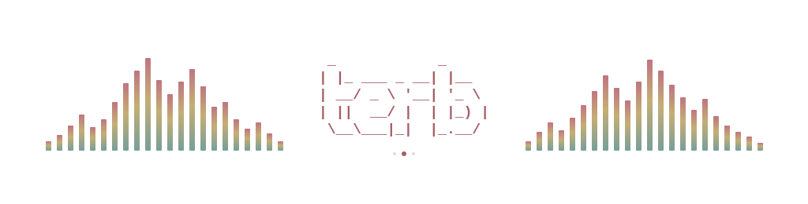
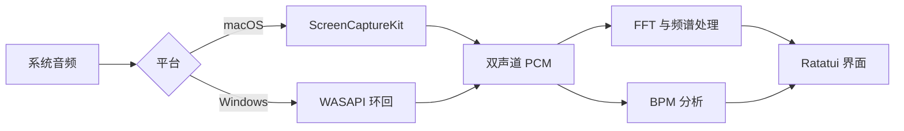

<h1 align="center">terb</h1>

<p align="center">
  <strong>简体中文</strong> · <a href="README.md">English</a>
</p>

<p align="center">
  <strong>在终端里，看见正在播放的声音。</strong><br>
  面向 macOS 与 Windows 系统音频的实时频谱、波形与节拍显示。
</p>

<p align="center">
  
  
  
  
  
</p>

<p align="center">
  <a href="#快速开始"><strong>开始使用</strong></a> ·
  <a href="#显示内容">功能</a> ·
  <a href="#快捷键">快捷键</a> ·
  <a href="#配置">配置</a> ·
  <a href="#工作原理">工作原理</a> ·
  <a href="#文档">文档</a>
</p>

<p align="center">
  
</p>

`terb` 把电脑正在播放的声音变成可调节的频谱。透明背景、三套克制的配色和单行工具栏，让画面留给音乐。音频在本机分析，不保存录音。

## 快速开始

预构建版本可在 [Releases 页面](https://github.com/pentaoa/terb/releases)下载。安装 macOS 下载包时，请将 `terb` 和 `terb-audio-helper` 放在同一目录。Windows 安装包只有一个 `terb.exe`，放到 PATH 中即可。运行 `terb --version` 可查看已安装版本。

**需要：** Rust 稳定版，以及：

- **macOS 14 或更新版本**，并安装 Xcode 或 Xcode Command Line Tools 提供的 Swift 编译器
- **Windows 10 或更新版本**，建议使用 [Windows Terminal](https://aka.ms/terminal) 或其他支持 Unicode 的终端

```bash
git clone https://github.com/pentaoa/terb.git
cd terb
cargo run --release --locked
```

播放一段音频，按 **空格** 开始。日常使用建议运行 release 版本。在 macOS 上，构建时会自动编译 Swift 采集助手。

> [!NOTE]
> 首次采集时，macOS 可能请求**屏幕与系统音频录制**权限。如果采集被拒绝，请在系统设置中允许终端或 Terb 助手，再按空格重试。
>
> Windows 通过 WASAPI 环回捕获默认播放设备，通常不会弹出额外权限请求。以独占模式运行的应用，或受保护的音频，可能不会出现在混音里。

透明度沿用终端配置。Terb 使用终端默认背景；背景透明度在终端应用中设置。

## 显示内容

| 视图 | 内容 |
| --- | --- |
| **频谱** | 方块、Braille 点阵或 CAVA 阶梯字符，随终端宽度展开 |
| **波形** | 使用 Braille 子像素显示正负振幅 |
| **立体声音量表** | 在频谱旁分别显示左右声道电平 |
| **节拍** | BPM 与拍点脉冲，可选 ONNX、传统算法或关闭 |
| **残影与重音** | 渐隐峰值、上浮轮廓，或音名闪现 |
| **主题** | Spring、Vintage、Mono，均保留终端背景 |

工具栏只占一行：**开始/暂停 · 设置 · 帮助**，启用节拍分析时在右侧显示 BPM。隐藏工具栏会把这一行还给频谱。小窗口会缩短标签、按需隐藏仪表；授权和采集错误在工具栏隐藏时仍会显示。

## 快捷键

| 页面 | 按键 | 操作 |
| --- | --- | --- |
| 菜单 / 频谱 / 设置 | <kbd>Space</kbd> | 开始或暂停采集；在设置中操作时保留当前页面 |
| 菜单 / 设置 | <kbd>↑</kbd> <kbd>↓</kbd> 或 <kbd>j</kbd> <kbd>k</kbd> | 移动选择 |
| 菜单 | <kbd>Enter</kbd> | 打开选中项目 |
| 菜单 / 频谱 | <kbd>s</kbd> | 打开设置 |
| 频谱 | <kbd>t</kbd> / <kbd>m</kbd> / <kbd>w</kbd> | 显示或隐藏工具栏 / 立体声音量表 / 波形 |
| 设置 | <kbd>←</kbd> <kbd>→</kbd> 或 <kbd>h</kbd> <kbd>l</kbd> | 调整并保存当前设置 |
| 设置 | <kbd>Tab</kbd> / <kbd>Shift</kbd> + <kbd>Tab</kbd> | 下一个 / 上一个分类 |
| 设置 | <kbd>s</kbd>、<kbd>q</kbd> 或 <kbd>Esc</kbd> | 返回打开设置前的页面 |
| 任意页面 | <kbd>?</kbd> | 打开帮助，再按一次返回 |
| 帮助 | <kbd>Enter</kbd>、<kbd>q</kbd> 或 <kbd>Esc</kbd> | 返回打开帮助前的页面 |
| 频谱 | <kbd>q</kbd> 或 <kbd>Esc</kbd> | 返回主菜单 |
| 菜单 | <kbd>q</kbd> 或 <kbd>Esc</kbd> | 退出 |

打开设置或帮助时，音频分析继续运行。暂停采集会保留最后一帧画面。

## 配置

按 <kbd>s</kbd> 打开**设置**。修改即时保存到 `~/.config/terb/config.json`（Windows 上为 `%USERPROFILE%\.config\terb\config.json`）。界面支持 **中文 · English · 日本語**。

### 分析预设

| 预设 | FFT 大小 | 分析步长 | 刷新率 |
| --- | ---: | ---: | ---: |
| **低延迟** — 默认 | 1,024 | 256 | 90 Hz |
| 均衡 | 2,048 | 512 | 60 Hz |
| 精细 | 8,192 | 2,048 | 45 Hz |

低延迟预设侧重响应速度；更大的 FFT 窗口提供更细的频率分辨率。预设也会调整上升和回落速度，各项参数可以继续单独修改。

### 显示与处理

| 类别 | 可调内容 |
| --- | --- |
| 外观 | 主题、渲染方式、频带数、工具栏、立体声音量表、波形 |
| 动态 | 上升/回落速度、频谱残影及衰减、重音模式和阈值 |
| 频谱 | FFT 大小、分析步长、刷新率、自适应灵敏度、降噪 |
| 频响与高度 | 高频补偿及增益、高度曲线及指数、限幅上限 |
| 节拍 | ONNX 模型、传统频谱通量算法或关闭 |

默认使用 **Spring**、**方块渲染**和 **72 个基础频带**，显示工具栏与立体声音量表，隐藏波形。显示分辨率随终端宽度调整；配置值与实际生效值不同时，设置页会分别列出。

<details>
<summary>参数范围</summary>

| 参数 | 范围 |
| --- | --- |
| 基础频带数 | 8–256 |
| FFT 大小 / 分析步长 | 512–16,384 / 64–4,096 个采样 |
| 刷新率 | 12、24、30、45、60、90、120、144、165、240 Hz |
| 上升 / 回落 | 2–100% / 0–99.5% |
| 高频补偿增益 | 0–36 dB |
| 降噪 | 0–95% |
| 高度曲线指数 | 0.25–2.50 |
| 残影衰减 | 20–99.5% |
| 重音阈值 | 2–98% |
| 限幅上限 | 35–100% |

</details>

## 工作原理

macOS 上，Swift 助手通过 **ScreenCaptureKit** 采集系统音频。Windows 上，WASAPI 环回捕获默认播放混音。两者都把立体声 PCM 交给 Rust；频谱分析按设定步长处理每个完整 FFT 窗口，终端以独立刷新率绘制最新结果。



默认节拍模式使用 **RTen** 在有界 CPU 工作队列中运行内嵌 ONNX 模型，推理不占用音频/UI 线程。传统模式使用频谱通量与滚动自相关；关闭模式跳过节拍分析。开始新一轮采集会重置分析历史，BPM 音频块丢失时也会作废旧历史。

自适应灵敏度逐渐抬高较弱输入，峰值接近上限时降低增益。重音轮廓在能量上升后向上渐隐，音名模式则在空白频谱区域显示渐隐标签。主题只改变前景配色，不填充背景。

<details>
<summary>项目结构</summary>

```text
assets/beat_tracker.onnx        内嵌节拍模型
macos/SystemAudioHelper.swift  ScreenCaptureKit 采集助手
src/capture.rs                 macOS 助手与 Windows WASAPI 采集
src/main.rs                    终端界面、操作与频谱处理
src/analysis.rs                频谱采样工具
src/beat.rs                    ONNX 工作队列与节拍解码
src/bpm.rs                     传统节奏分析
src/features.rs                流式 Mel 特征
src/bin/                       离线 BPM 与基准工具
docs/                          模型说明、数据来源与实验记录
```

</details>

## 开发

```bash
cargo test --all-targets --locked
cargo build --release --locked --bins
```

开发构建会优化推理与 FFT 依赖，同时保留调试信息。离线测试覆盖信号处理、渲染与导航；实时采集另行手动验证。

## 文档

| 文档 | 内容 |
| --- | --- |
| [当前节拍模型](docs/current-beat-model.zh-CN.md) | 模型、流式特征、调度与延迟 |
| [数据来源](docs/beat-data.zh-CN.md) | 训练和评测数据的来源与归属 |
| [封存评测报告](docs/benchmarks/giantsteps-sealed-report.md) | 已记录的 GiantSteps 评测结果 |
